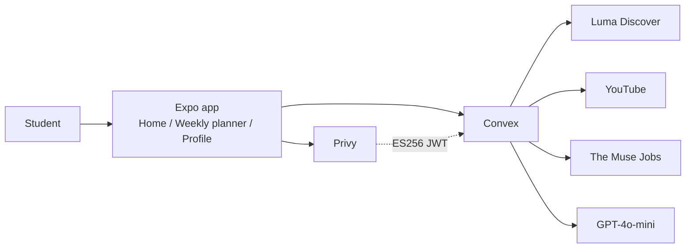

# North Bound

Figuring out college is hard. You have a dream job in mind, but getting there can feel like guesswork. North Bound gives high school and college students a personal career companion from the start—a north star that turns their interests, skills, and ambitions into a clear path forward. Discover courses to take, events to attend, and internships to apply for, all aligned with your long-term goal. Each weekly step helps you build toward bigger milestones, from your first internship to graduation. As you gain experience, your progress informs future recommendations, and your accomplishments come together in a resume. Spend less time wondering what comes next and more time building the future you want.

Expo app for desktop web, mobile web, iOS, and Android, with a Convex backend and Privy login.

## Quick start

**Prerequisites:** Node.js 20.19+, a [Privy](https://dashboard.privy.io) app, and [Expo Go](https://expo.dev/go) (or Xcode / Android Studio) if you want native.

```bash
npm install
cp .env.example .env.local
```

Fill `EXPO_PUBLIC_PRIVY_APP_ID` and `EXPO_PUBLIC_PRIVY_CLIENT_ID` in `.env.local` (see [Reproduce the demo](#reproduce-the-demo)).

In the Privy dashboard, enable **Email**, **SMS**, **Google**, and **Twitter**. Allow `http://localhost:8081` for web. For native, add an app client, allow the `cursoraitxhackathon` scheme, and for Expo Go add `host.exp.Exponent`.

Start Convex, then copy the Privy app ID onto the deployment:

```bash
npm run convex:dev
npx convex env set PRIVY_APP_ID <your-privy-app-id>
```

`convex dev` writes `EXPO_PUBLIC_CONVEX_URL` into `.env.local`. In another terminal:

```bash
npm start            # then press i, a, or w
npm run web          # desktop and mobile web
```

Other scripts: `npm run ios`, `npm run android`, `npm run export:web` (static web build in `dist/`).

## Tech stack and architecture

| Layer | Stack |
| --- | --- |
| Client | Expo 57, Expo Router, React Native 0.86 / React 19 |
| Auth | Privy (email, SMS, Google, Twitter) |
| Backend | Convex (queries, mutations, actions, schema) |
| Ranking | GPT-4o-mini via Convex AI Gateway, or `OPENAI_API_KEY` |
| Live catalogs | [Luma](https://lu.ma) events, YouTube courses, [The Muse](https://www.themuse.com/developers/api/v2) jobs |
| Resume | Profile + activity log, printable PDF (`expo-print`) |



**Flow**

1. Sign in with Privy. Convex verifies the JWT (`convex/auth.config.ts`) and upserts the user (`convex/users.ts`).
2. Onboarding stores school, year, location, birthday, industry, role, preferred company, and skills.
3. Home builds a graduation journey from that profile (LLM internship titles when available).
4. Weekly planner fetches live events, YouTube courses, and Muse listings, then ranks them with GPT against the profile and activity log.
5. Completing an item writes `activityLog`. The next analysis skips those IDs and uses the log as prompt context.
6. Profile turns logged events, courses, and internships into a resume PDF.

## Reproduce the demo

### Environment

Copy `.env.example` to `.env.local`. Client keys are inlined at build time.

```bash
# Client (Expo)
EXPO_PUBLIC_CONVEX_URL=https://<your-deployment>.convex.cloud
EXPO_PUBLIC_PRIVY_APP_ID=clxxxxxxxx
EXPO_PUBLIC_PRIVY_CLIENT_ID=client-xxxxxxxx

# Convex deployment (set with npx convex env set, not only .env.local)
PRIVY_APP_ID=clxxxxxxxx

# Optional if Convex AI Gateway is not enabled
OPENAI_API_KEY=sk-...

# Optional; without it, course search uses YouTube's public search API
YOUTUBE_API_KEY=
```

Set secrets on Convex (they never go to Vercel):

```bash
npx convex env set PRIVY_APP_ID <same-as-EXPO_PUBLIC_PRIVY_APP_ID>
npx convex env set OPENAI_API_KEY <your-openai-key>   # if gateway is off
npx convex env set YOUTUBE_API_KEY <youtube-data-api-key>  # optional
```

`PRIVY_APP_ID` is required. ChatGPT needs either the Convex AI Gateway or `OPENAI_API_KEY`. Luma and The Muse are public HTTP APIs and do not need keys.

### Production web (Vercel)

The web app is a static Expo export (`expo.web.output` is `static`). Import the repo in [Vercel](https://vercel.com/new) with framework **Other**. Set `EXPO_PUBLIC_CONVEX_URL` (production Convex URL), `EXPO_PUBLIC_PRIVY_APP_ID`, and `EXPO_PUBLIC_PRIVY_CLIENT_ID`. Allow the Vercel origin in Privy. Redeploy after changing `EXPO_PUBLIC_*` values.

### Demo walkthrough

Use a fresh account so onboarding runs.

1. Open the app (`npm run web` is the fastest path). Sign in with email or Google.
2. Complete onboarding with a dense profile, for example:
   - High school / GPA: any plausible values
   - College: 2nd year
   - Location: **United States → Texas → Austin** (Luma has a city hub)
   - Industry: Technology · Role: Software engineer · Company: OpenAI
   - Hard skills: e.g. Python 4/5, React 3/5
   - Soft skills: any 1–5 ratings
3. On **Home**, confirm the journey path (current year vs graduation goal).
4. Open **Weekly planner → Events / Courses / Internships**. First load may take a few seconds (live fetch + ranking). You should see a short summary plus ranked cards with reasons.
5. Mark an event attended and a course completed. Refresh recommendations: logged items should drop out, and the prompt should mention prior activity.
6. Open **Profile**, check standing / this week, then export or print the resume PDF.

If events are empty, try a mapped hub city (Austin, San Francisco, NYC, Boston, Chicago). If ranking fails, confirm the AI Gateway or `OPENAI_API_KEY`. If internships look like full-time jobs, that is Muse’s public job catalog, not an intern-only feed.

## Datasets and synthetic data

This repo does **not** ship a training dataset or scraped dump. Recommendations are live API results plus an LLM ranker.

| Source | What it is | Provenance |
| --- | --- | --- |
| Luma Discover | Public events near the student’s city | Unofficial `api.luma.com/discover` endpoints used at request time (`convex/luma.ts`). City names map onto Luma hub slugs (e.g. Berkeley → SF). |
| YouTube | Playlists and long videos as “courses” | Official YouTube Data API v3 when `YOUTUBE_API_KEY` is set; otherwise YouTube’s public Innertube search (`convex/youtube.ts`). Short videos are filtered out. |
| The Muse | Job listings used as internship candidates | Public [Muse Jobs API v2](https://www.themuse.com/developers/api/v2) (`convex/jobs.ts`). Role/industry map onto Muse categories. |
| GPT-4o-mini | Rank, summarize, name yearly internship titles | Convex AI Gateway (`openai/gpt-4o-mini`) or OpenAI Chat Completions. Outputs are stored per user in `eventAnalyses`, `courseAnalyses`, `internshipAnalyses`, `journeyPlans`. |
| Onboarding catalogs | Industries, roles, companies, city/state tree | Hand-authored lists in `src/constants/onboarding.ts` and `src/constants/locations.ts` (not scraped). Students can enter custom values. |
| Journey title presets | Fallback intern titles by role/year | Hand-authored in `src/constants/journey.ts`; used when ChatGPT is unavailable. |
| Student data | Profile + activity log | Created in-app. No seed users. |

No synthetic resumes, fake events, or fixture job boards are committed.

## Known limitations and next steps

**Limitations**

- Events depend on Luma coverage and a coarse city→hub map; many college towns fold into a nearby metro.
- “Courses” are public YouTube playlists/videos, not registrar or Coursera catalogs.
- Muse listings are general jobs, not a dedicated internship API, so senior roles can appear.
- YouTube without an API key uses an unofficial public search client that can break.
- Each planner category keeps one latest analysis per user (refresh replaces it). The activity log is the durable history.
- Resume is assembled from logged items and profile fields, not a full employment history.
- Location pickers are a curated country/state/city tree, not geocoding.
- `@stripe/stripe-js` is unused (Privy dependency). There is no payments product.

**Next steps**

- Official university / Coursera / Handshake (or similar) catalogs for courses and internships.
- Tighter internship filters and company-specific recruiting calendars.
- Multi-week planner with deadlines, reminders, and application tracking.
- Richer resume export (projects, coursework, school transcripts) and shareable public profile.
- Better geo matching for events beyond Luma hubs.
- Caching and rate-limit handling for Luma, YouTube, and Muse.
- Native-polish pass (Expo Go vs store builds) and production observability.
